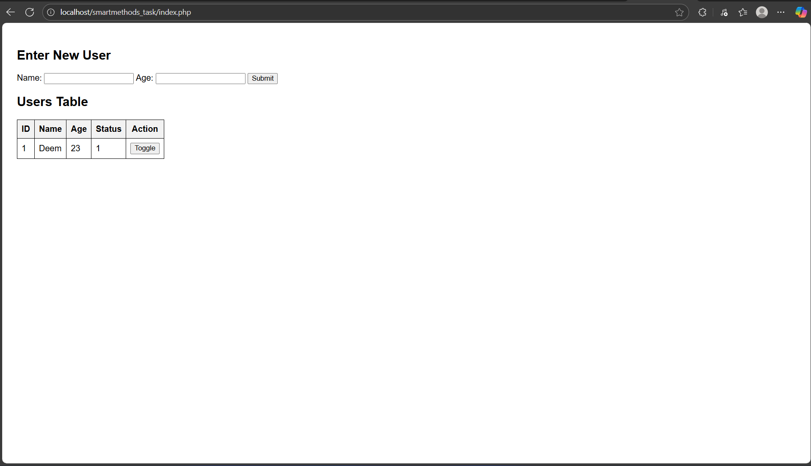

# Users management Web page

This project is a simple web-based task using HTML, CSS, JavaScript, PHP, and MySQL.

---

##  Technologies Used

- HTML / CSS / JavaScript
- PHP
- MySQL (via phpMyAdmin)
- XAMPP (Apache + MySQL server)

---
## Files included :
- `index.php` – Main web interface
- `db.php` – Database connection
- `toggle.php` – Status update logic
- `script.js` – JavaScript for live toggle
- `style.css` – Page styling

---
##  How to Run Locally

1. Install [XAMPP](https://www.apachefriends.org/)
2. Create a folder under: C:\xampp\htdocs\
3. Place all files inside it (`index.php`, `db.php`, `script.js`, `style.css`, `toggle.php`)
4. Open XAMPP and start:
- Apache
- MySQL
5. Go to browser and visit: [localhost/phpMyadmin](http://localhost/phpmyadmin)
6. Create a database named `task_db`
7. Run this SQL query to create the `users` table:
```sql
CREATE TABLE users (
id INT AUTO_INCREMENT PRIMARY KEY,
name VARCHAR(50),
age INT,
status TINYINT
);
```
8. Now open the webpage in your browser:

http://localhost/Your_Folder's_Name/

---

## Screenshots

---

## Result
+ You can add name + age using the form.

+ Records appear in the table.

+ Toggle button changes status between 0 and 1 instantly.
+ Status is updated immediately without reloading the page .
